# UX Architecture Document — Soul Train's Eatery

> **Version 3.0** | Updated: February 2026
> Authoritative 4-layer reference for user journeys, system behaviors, and error flows.
> Complements [STATUS_TRANSITION_MATRIX.md](./STATUS_TRANSITION_MATRIX.md) and [WORKFLOW_DIAGRAMS.md](./WORKFLOW_DIAGRAMS.md).

---

## Table of Contents

1. [System Overview & Actors](#1-system-overview--actors)
2. [Layer 1 — User Journey Maps (Emotional Arcs)](#2-layer-1--user-journey-maps)
3. [Layer 2 — Use Case Diagrams](#3-layer-2--use-case-diagrams)
4. [Layer 3 — Interaction & Sequence Diagrams](#4-layer-3--interaction--sequence-diagrams)
5. [Layer 4 — Structural Diagrams](#5-layer-4--structural-diagrams)
6. [Error & Exception Flows](#6-error--exception-flows)
7. [Deployment & Infrastructure](#7-deployment--infrastructure)

---

## 1. System Overview & Actors

### 1.1 Technology Stack

| Layer | Technology |
|-------|-----------|
| Frontend | React 18 + Vite + TypeScript |
| Styling | Tailwind CSS + shadcn/ui |
| State | TanStack React Query |
| Backend | Supabase (Postgres + Auth + Edge Functions) |
| Payments | Stripe Checkout + Webhooks |
| Hosting | Lovable Cloud |

### 1.2 Actor Definitions

| Actor | Auth Mechanism | Access Pattern |
|-------|---------------|----------------|
| **Customer** | Token-based (`customer_access_token`) | Unauthenticated; accesses portal via unique URL with token |
| **Admin** | Supabase Auth + `has_role('admin')` RPC | Full CRUD on events, estimates, billing, settings |
| **Staff** | Supabase Auth + `has_any_role()` RPC | Read-only access to event schedule and calendar feed |
| **System** | Cron triggers + Stripe webhooks | Automated workflows, reminders, token renewal |

### 1.3 Route Map by Actor

#### Public Routes (No Auth)
| Route | Component | Purpose |
|-------|-----------|---------|
| `/` | `Index` | Homepage — discovery & intent |
| `/about` | `About` | Company story |
| `/menu` | `SimplifiedMenu` | Full catering menu |
| `/request-quote` | `RequestQuote` | Quote type selector |
| `/request-quote/regular` | `RegularEventQuote` | Regular event quote wizard |
| `/request-quote/wedding` | `WeddingEventQuote` | Wedding quote wizard |
| `/request-quote/thank-you` | `QuoteThankYou` | Submission confirmation |
| `/reviews` | `Reviews` | Customer testimonials |
| `/gallery` | `AlternativeGallery` | Event photo gallery |
| `/faq` | `FAQ` | Frequently asked questions |
| `/privacy-policy` | `PrivacyPolicy` | Legal |
| `/terms-conditions` | `TermsConditions` | Legal |

#### Customer Portal Routes (Token-Based)
| Route | Component | Purpose |
|-------|-----------|---------|
| `/estimate` | `CustomerEstimateView` | Estimate review portal |
| `/customer-portal` | `CustomerEstimateView` | Alias for estimate portal |
| `/customer/estimate/:token` | `CustomerEstimateView` | Direct token access |
| `/customer/estimate-preview/:invoiceId` | `CustomerEstimateView` | Preview by invoice ID |
| `/estimate-preview/:token` | `CustomerEstimateView` | Token-based preview |
| `/invoice/public/:invoiceToken` | `CustomerEstimateView` | Public invoice link |
| `/approve/*` | `ApproveEstimate` | One-click email approval |
| `/approve-estimate` | `ApproveEstimate` | Approval deep link |
| `/payment-success` | `PaymentSuccess` | Post-payment confirmation |
| `/payment-canceled` | `PaymentCanceled` | Payment failure/cancel |

#### Admin Routes (Role-Gated)
| Route | Component | Purpose |
|-------|-----------|---------|
| `/admin/auth` | `AdminAuth` | Login page |
| `/admin` | `UnifiedAdminDashboard` | 3-view dashboard (Events, Billing, Settings) |
| `/admin/event/:quoteId` | `EventEstimateFullViewPage` | Full-viewport event detail |
| `/admin/event/:quoteId/menu` | `AdminMenuEditPage` | Menu line item editor |
| `/admin/estimate-print/:invoiceId` | `EstimatePrintView` | Print-optimized estimate |

#### Staff Routes (Role-Gated)
| Route | Component | Purpose |
|-------|-----------|---------|
| `/staff` | `StaffSchedule` | Calendar view of upcoming events |

---

## 2. Layer 1 — User Journey Maps

### 2.1 Customer Journey (10 Phases)

```
Phase        Emotion       Touchpoint                      Component / Edge Function
─────────────────────────────────────────────────────────────────────────────────────
1. Discovery   Curious       Homepage visit                  Index (Hero, ServiceTypes, Testimonials)
2. Intent      Interested    Click "Get a Quote"             RequestQuote (event type selector)
3. Submission  Focused       6-step wizard form              SinglePageQuoteForm → submit-quote-request
4. Confirm     Relieved      Thank-you page                  QuoteThankYou ← send-quote-confirmation
5. Waiting     Anxious       Check email for updates         (no UI — wait for admin action)
6. Review      Hopeful       Open portal link from email     CustomerEstimateView (3-column layout)
7. Decision    Empowered     Approve or Request Changes      CustomerActions → approve-estimate / ChangeRequestModal
8. Payment     Determined    Pay deposit or full amount      PaymentCard → create-checkout-session → Stripe
9. Confirmed   Delighted     Payment success page            PaymentSuccess ← stripe-webhook + verify-payment
10. Event Day  Excited       Catered event                   (offline — Soul Train delivers)
```

**Key anxiety points:**
- Phase 5 (Waiting): Customer has no visibility into admin actions. Mitigated by confirmation email with contact info.
- Phase 8 (Payment): Redirect to Stripe and back. Mitigated by 3-layer payment verification.

### 2.2 Admin Journey (10 Phases)

```
Phase              Emotion        Touchpoint                      Component / Edge Function
────────────────────────────────────────────────────────────────────────────────────────────
1. Auth             Neutral        Login                           AdminAuth → Supabase Auth → has_role()
2. Dashboard        Oriented       Events overview                 UnifiedAdminDashboard → EventsView
3. New Submissions  Alert          SubmissionsCard badge            SubmissionsCard (pending count)
4. Event Deep Dive  Focused        Click into event                EventEstimateFullViewPage
5. Estimate Create  Productive     Generate estimate               generate-invoice-from-quote → EstimatePanelContent
6. Send to Customer Confident      Email estimate link             send-customer-portal-email
7. Change Requests  Attentive      Review customer changes         ChangeRequestProcessor → process-change-request
8. Payment Track    Satisfied      Monitor milestones              PaymentList → PaymentCard status
9. Event Complete   Accomplished   Mark event done                 workflow_status → 'completed'
10. Settings        Maintenance    Email templates, notifications  NotificationPreferencesPanel, EmailDeliveryPanel
```

### 2.3 Staff Journey (4 Phases)

```
Phase              Emotion        Touchpoint                      Component
────────────────────────────────────────────────────────────────────────────
1. Auth             Neutral        Login                           AdminAuth → has_any_role()
2. Event List       Oriented       View upcoming events            StaffSchedule (calendar views)
3. Event Details    Informed       Click event for details         Event detail cards (read-only)
4. Calendar Sub     Convenient     Subscribe via iCal              staff-calendar-feed edge function
```

---

## 3. Layer 2 — Use Case Diagrams

### 3.1 Customer Use Cases

| ID | Use Case | Precondition | Postcondition |
|----|----------|-------------|---------------|
| UC-C1 | Browse menu | None | Customer sees full catering options |
| UC-C2 | Submit quote request | Valid form data | Quote saved, confirmation email sent, admin notified |
| UC-C3 | View estimate via portal | Valid token URL | Customer sees 3-column estimate layout |
| UC-C4 | Approve estimate | Estimate in `sent` status | Invoice transitions to `approved`, milestones generated |
| UC-C5 | Request changes | Estimate in `sent` status | Change request created, admin notified |
| UC-C6 | Pay deposit | Approved invoice with milestones | Stripe checkout → milestone marked paid |
| UC-C7 | Pay remaining balance | Deposit paid, balance milestone due | Stripe checkout → invoice fully paid |
| UC-C8 | Download PDF | Valid portal access | PDF generated and downloaded |
| UC-C9 | View payment history | Valid portal access | Payment milestones and transaction history displayed |

### 3.2 Admin Use Cases

| ID | Use Case | Precondition | Postcondition |
|----|----------|-------------|---------------|
| UC-A1 | View dashboard | Authenticated admin | Events/Billing/Settings views available |
| UC-A2 | Review new submission | Quote in `pending` status | Admin opens event detail |
| UC-A3 | Generate estimate | Quote reviewed | Invoice created with line items from quote data |
| UC-A4 | Edit estimate line items | Invoice exists | Line items updated, live total recalculated |
| UC-A5 | Apply discount | Invoice exists | Discount saved, totals recalculated |
| UC-A6 | Send estimate to customer | Invoice ready | Email sent with portal link + token |
| UC-A7 | Process change request | Change request pending | Admin approves/rejects, new version if needed |
| UC-A8 | Track payments | Milestones exist | View payment status per milestone |
| UC-A9 | Manage staff assignments | Event exists | Staff assigned with roles and arrival times |
| UC-A10 | Manage event checklist | Event exists | Timeline tasks created/completed |
| UC-A11 | Manage shopping list | Event exists | Shopping items tracked by category |
| UC-A12 | Send manual email | Event exists | Custom email sent to customer |
| UC-A13 | View email delivery | Emails sent | Delivery status and open tracking visible |
| UC-A14 | Configure notifications | Authenticated admin | Push/email notification preferences saved |
| UC-A15 | Print estimate | Invoice exists | Print-optimized view rendered |

### 3.3 Staff Use Cases

| ID | Use Case | Precondition | Postcondition |
|----|----------|-------------|---------------|
| UC-S1 | View event schedule | Authenticated staff | Calendar with confirmed events displayed |
| UC-S2 | View event details | Event visible in schedule | Read-only event info shown |
| UC-S3 | Subscribe to calendar | Authenticated staff | iCal feed URL generated |

### 3.4 System (Automated) Use Cases

| ID | Use Case | Trigger | Action |
|----|----------|---------|--------|
| UC-SYS1 | Auto-advance workflow | Cron (15 min) | `auto-workflow-manager` transitions statuses |
| UC-SYS2 | Send reminders | Cron (daily) | `unified-reminder-system` sends payment/event reminders |
| UC-SYS3 | Renew tokens | Cron (daily) | `token-renewal-manager` extends expiring tokens |
| UC-SYS4 | Process Stripe webhook | Stripe event | `stripe-webhook` updates payment status |
| UC-SYS5 | Track email opens | Pixel load | `track-email-open` records open timestamp |
| UC-SYS6 | Track visitors | Page view | `track-visitor` logs analytics event |
| UC-SYS7 | Rate limit check | Form submit | `rate-limit-check` prevents abuse |
| UC-SYS8 | Validate totals | Invoice save | `validate-invoice-totals` ensures consistency |

---

## 4. Layer 3 — Interaction & Sequence Diagrams

### 4.1 Quote Submission Flow

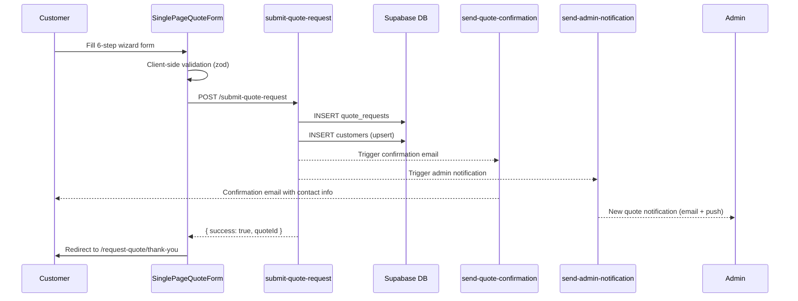

### 4.2 Estimate Generation & Delivery

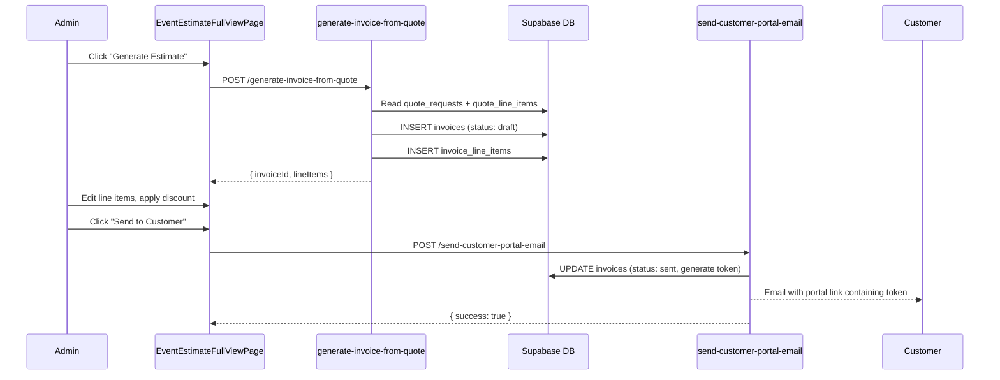

### 4.3 Customer Approval Flow

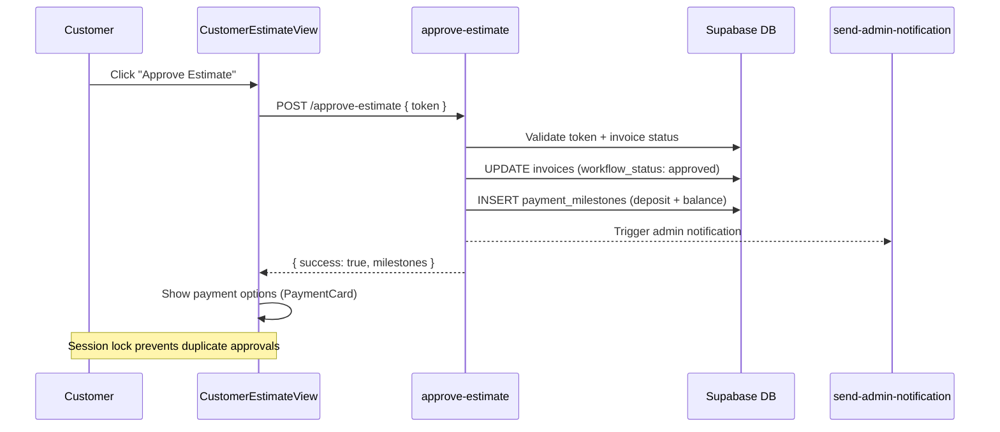

### 4.4 Change Request Cycle

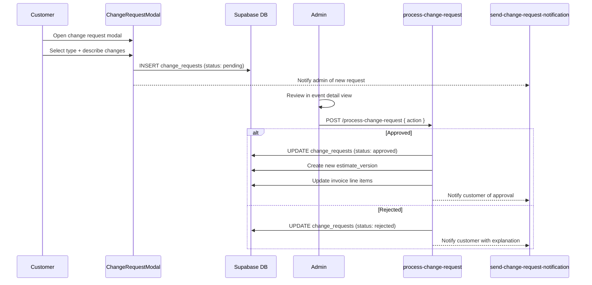

### 4.5 Payment Flow (3-Layer Architecture)

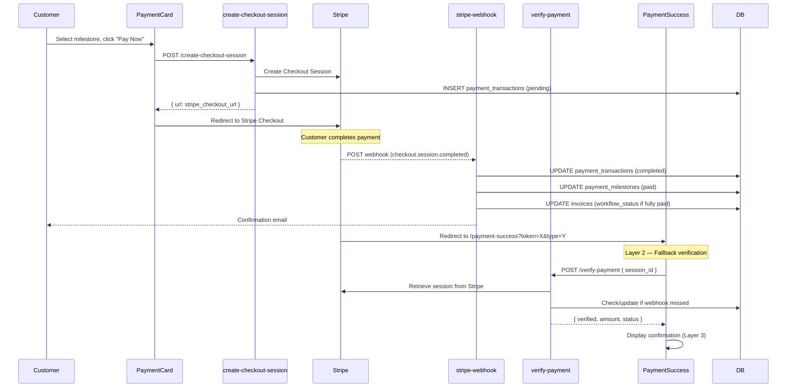

### 4.6 Authentication & Role Routing

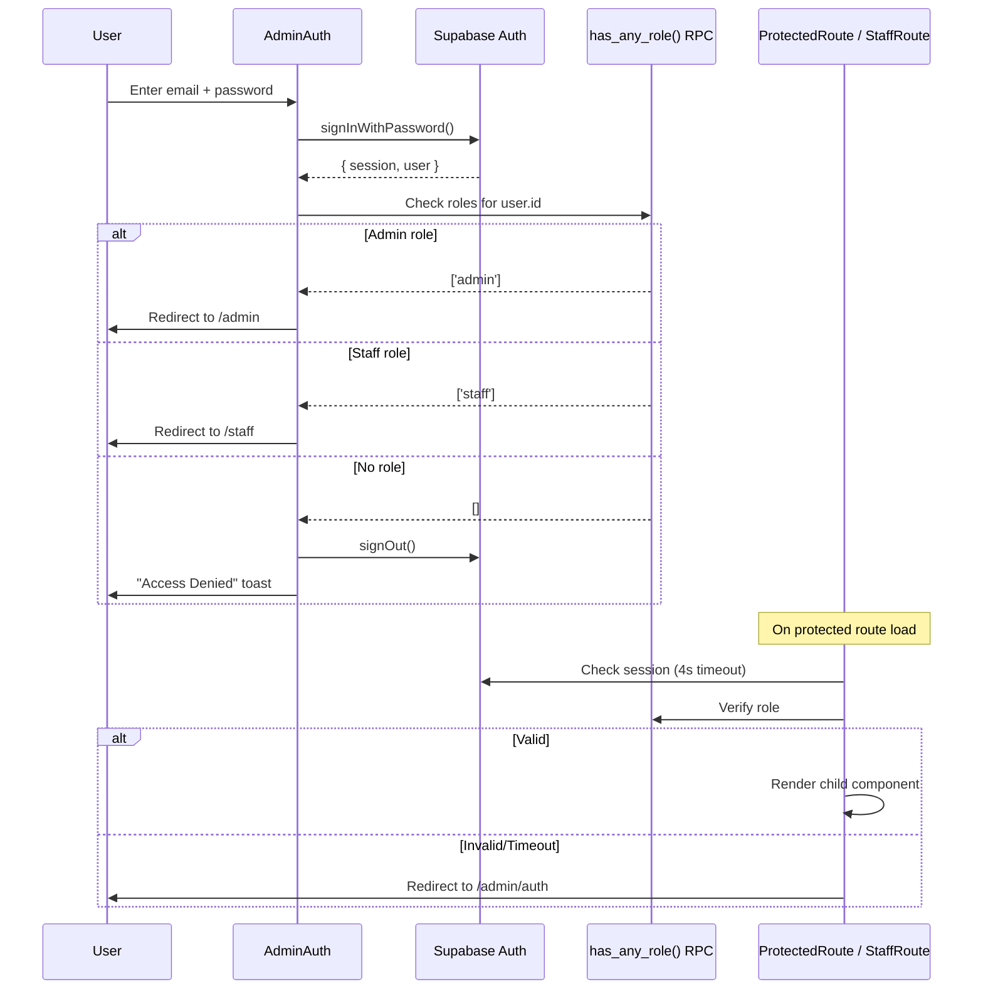

### 4.7 Activity Diagram — Quote Form Wizard

```mermaid
graph TD
    A[Start: Customer lands on /request-quote] --> B{Event Type?}
    B -->|Regular| C[/request-quote/regular]
    B -->|Wedding| D[/request-quote/wedding]

    C --> E[Step 1: Event Details]
    D --> E

    E --> F{Valid?}
    F -->|No| E
    F -->|Yes| G[Step 2: Menu Selection]

    G --> H{Wedding?}
    H -->|Yes| I[Show wedding-specific fields: ceremony, cocktail hour, theme colors]
    H -->|No| J[Standard menu options]

    I --> K[Step 3: Proteins & Sides]
    J --> K

    K --> L[Step 4: Extras & Services]
    L --> M{Wait staff needed?}
    M -->|Yes| N[Show wait staff details fields]
    M -->|No| O[Skip to Step 5]

    N --> O
    O --> P[Step 5: Dietary & Special Requests]
    P --> Q[Step 6: Review & Submit]
    Q --> R{Rate limit check}
    R -->|Blocked| S[Show rate limit message]
    R -->|OK| T[submit-quote-request]
    T --> U[Redirect: /request-quote/thank-you]
```

### 4.8 Activity Diagram — Admin Estimate Editing

```mermaid
graph TD
    A[Admin opens event detail] --> B{Invoice exists?}
    B -->|No| C[Click "Generate Estimate"]
    B -->|Yes| D[View existing estimate]

    C --> E[generate-invoice-from-quote]
    E --> D

    D --> F[Edit line items: title, qty, price]
    F --> G[Live total recalculates via useMemo]
    G --> H{Apply discount?}

    H -->|Yes| I[Set discount type + amount]
    I --> J[Totals update with discount]
    H -->|No| J

    J --> K[Click "Save Changes"]
    K --> L[Save to DB + validate-invoice-totals]
    L --> M{Send to customer?}

    M -->|Yes| N[send-customer-portal-email]
    N --> O[Invoice status → sent]
    M -->|No| P[Invoice remains draft]
```

### 4.9 Activity Diagram — Payment Processing

```mermaid
graph TD
    A[Customer views PaymentCard] --> B{Milestones exist?}
    B -->|No| C[Show: "Awaiting estimate approval"]
    B -->|Yes| D{Which milestone is due?}

    D --> E[Select deposit or balance]
    E --> F[Click "Pay Now"]
    F --> G[create-checkout-session]
    G --> H[Redirect to Stripe]

    H --> I{Payment outcome}
    I -->|Success| J[Stripe redirects to /payment-success]
    I -->|Cancel| K[Stripe redirects to /payment-canceled]
    I -->|Failure| K

    J --> L[verify-payment fallback check]
    L --> M{Webhook already processed?}
    M -->|Yes| N[Show confirmed status]
    M -->|No| O[verify-payment updates DB]
    O --> N

    K --> P[Show retry + contact options]

    Note1[stripe-webhook runs async] -.-> M
```

---

## 5. Layer 4 — Structural Diagrams

### 5.1 Component Hierarchy

```
App
├── QueryClientProvider
│   └── ErrorBoundary
│       └── ThemeProvider
│           └── TooltipProvider
│               └── BrowserRouter
│                   └── AuthProvider
│                       └── HeroVisibilityProvider
│                           └── AppContent
│                               ├── Header (hidden on admin/staff/wizard routes)
│                               ├── <Routes>
│                               │   ├── PUBLIC
│                               │   │   ├── Index (Hero, ServiceTypes, Testimonials, CTA)
│                               │   │   ├── About
│                               │   │   ├── SimplifiedMenu
│                               │   │   ├── RequestQuote → RegularEventQuote / WeddingEventQuote
│                               │   │   │   └── SinglePageQuoteForm (6-step wizard)
│                               │   │   ├── QuoteThankYou
│                               │   │   ├── Reviews, AlternativeGallery, FAQ
│                               │   │   └── PrivacyPolicy, TermsConditions
│                               │   │
│                               │   ├── CUSTOMER PORTAL (token-based)
│                               │   │   ├── CustomerEstimateView
│                               │   │   │   ├── CustomerContactCard
│                               │   │   │   ├── CustomerActions (Approve / Request Changes)
│                               │   │   │   ├── PaymentCard (milestone payments)
│                               │   │   │   ├── MenuActionsPanel (line items + notes)
│                               │   │   │   └── ChangeRequestModal
│                               │   │   ├── ApproveEstimate (one-click email flow)
│                               │   │   ├── PaymentSuccess
│                               │   │   └── PaymentCanceled
│                               │   │
│                               │   ├── ADMIN (ProtectedRoute)
│                               │   │   ├── AdminAuth
│                               │   │   ├── UnifiedAdminDashboard
│                               │   │   │   ├── EventsView
│                               │   │   │   │   ├── SubmissionsCard
│                               │   │   │   │   └── EventList (list / week / month views)
│                               │   │   │   ├── PaymentList (billing view)
│                               │   │   │   └── Settings
│                               │   │   │       ├── NotificationPreferencesPanel
│                               │   │   │       ├── EmailTemplatePreview
│                               │   │   │       └── EmailDeliveryPanel
│                               │   │   ├── EventEstimateFullViewPage
│                               │   │   │   ├── EventDetailsPanelContent
│                               │   │   │   ├── EstimatePanelContent
│                               │   │   │   ├── EventChecklistPanel
│                               │   │   │   ├── StaffAssignmentPanel
│                               │   │   │   └── ShoppingListPanel
│                               │   │   ├── AdminMenuEditPage
│                               │   │   └── EstimatePrintView
│                               │   │
│                               │   └── STAFF (StaffRoute)
│                               │       └── StaffSchedule
│                               │
│                               ├── Footer (hidden on admin/staff/wizard routes)
│                               ├── MobileActionBar (mobile only, public routes)
│                               └── ScrollToTop
```

### 5.2 State Machines

#### Quote Request States

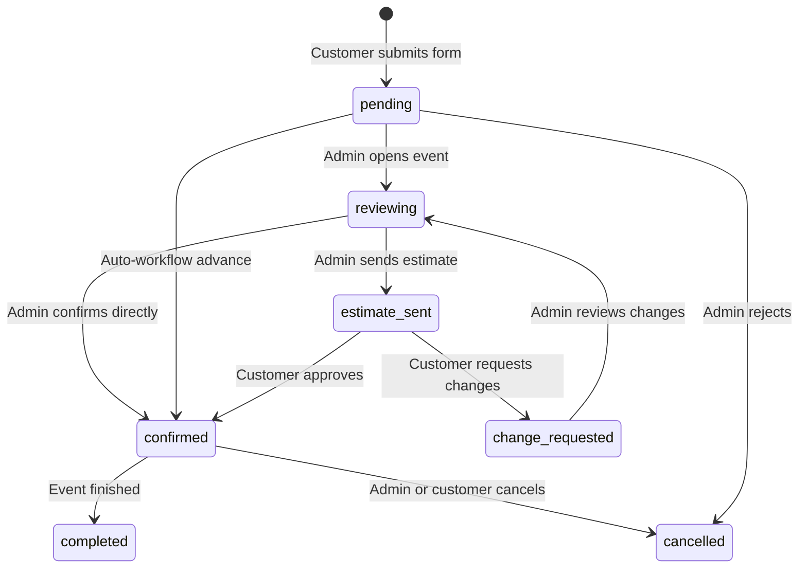

#### Invoice States

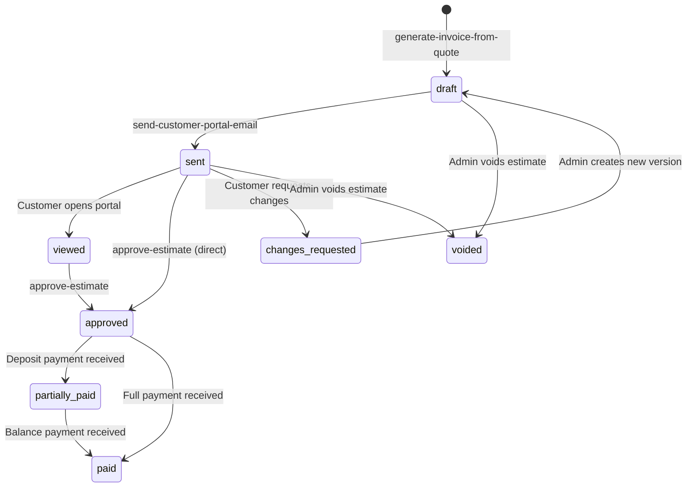

#### Payment Milestone States

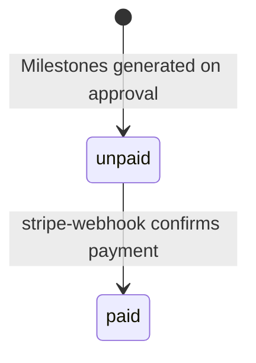

#### Change Request States

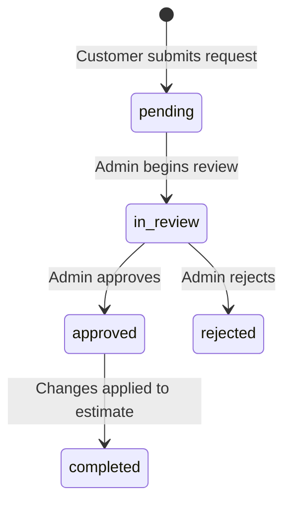

### 5.3 Entity Relationship Diagram

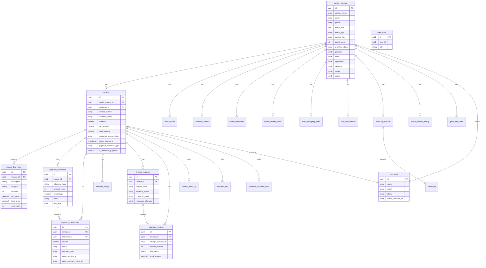

### 5.4 Service Layer Map

| Service | File | Responsibility |
|---------|------|---------------|
| EventDataService | `EventDataService.ts` | CRUD for quote requests and related event data |
| PaymentDataService | `PaymentDataService.ts` | Payment queries, transaction lookups |
| PaymentMilestoneService | `PaymentMilestoneService.ts` | Milestone CRUD, status transitions |
| TaxCalculationService | `TaxCalculationService.ts` | Tax rate calculation and application |
| InvoiceTotalsRecalculator | `InvoiceTotalsRecalculator.ts` | Subtotal/tax/total recalculation after edits |
| LineItemsService | `LineItemsService.ts` | Invoice line item CRUD, sort ordering |
| ChangeRequestService | `ChangeRequestService.ts` | Change request submission and queries |
| ChangeRequestProcessor | `ChangeRequestProcessor.ts` | Admin-side change request approval/rejection |
| EmailNotificationService | `EmailNotificationService.ts` | Email dispatch via edge functions |
| EstimateVersionService | `EstimateVersionService.ts` | Estimate version snapshots and history |
| HistoryLogger | `HistoryLogger.ts` | Audit trail for quote field changes |
| MenuItemService | `MenuItemService.ts` | Menu item data and categorization |
| QuoteUpdateService | `QuoteUpdateService.ts` | Quote field updates with history logging |

### 5.5 Edge Function Inventory (46 Functions)

#### Email Functions (12)
| Function | Purpose |
|----------|---------|
| `send-smtp-email` | Core SMTP sender (Gmail) |
| `send-quote-confirmation` | Customer quote receipt |
| `send-admin-notification` | Admin alert for new quotes/changes |
| `send-customer-portal-email` | Estimate link with token |
| `send-change-request-notification` | Change request status updates |
| `send-quote-notification` | Quote action notifications |
| `send-status-notification` | Status change alerts |
| `send-event-followup` | Post-event follow-up |
| `send-event-reminders` | Pre-event reminders |
| `send-payment-reminder` | Payment due notifications |
| `send-manual-email` | Admin-composed custom emails |
| `send-test-email` | Email template testing |

#### Payment Functions (7)
| Function | Purpose |
|----------|---------|
| `create-checkout-session` | Stripe Checkout session creation |
| `create-payment-intent` | Direct payment intent |
| `create-payment-link` | Reusable payment link |
| `create-stripe-customer` | Stripe customer creation |
| `stripe-webhook` | Webhook event processing |
| `verify-payment` | Fallback payment verification |
| `apply-payment-waterfall` | Multi-milestone payment application |

#### Workflow & Data Functions (13)
| Function | Purpose |
|----------|---------|
| `submit-quote-request` | Quote form backend processing |
| `approve-estimate` | Estimate approval + milestone generation |
| `generate-invoice-from-quote` | Invoice creation from quote data |
| `generate-payment-milestones` | Milestone schedule generation |
| `process-change-request` | Admin change request handling |
| `confirm-event` | Event confirmation workflow |
| `update-quote-workflow` | Quote status transitions |
| `sync-invoice-with-quote` | Invoice ↔ quote data sync |
| `validate-invoice-totals` | Total consistency checks |
| `fix-workflow-status` | Status correction utility |
| `workflow-orchestrator` | Complex multi-step workflows |
| `generate-invoice-pdf` | PDF generation for download |
| `event-timeline-generator` | Prep task timeline creation |

#### Infrastructure Functions (8)
| Function | Purpose |
|----------|---------|
| `auto-workflow-manager` | Cron: auto-advance statuses (every 15 min) |
| `unified-reminder-system` | Cron: daily reminder dispatch |
| `token-renewal-manager` | Cron: extend expiring tokens |
| `automated-customer-workflow` | Automated customer lifecycle |
| `rate-limit-check` | Abuse prevention |
| `track-email-open` | Email open tracking pixel |
| `track-visitor` | Page view analytics |
| `staff-calendar-feed` | iCal feed for staff |

#### Testing & QA Functions (6)
| Function | Purpose |
|----------|---------|
| `send-batch-test-emails` | Batch email testing |
| `preview-email` | Email template preview |
| `email-qa-report` | Email delivery diagnostics |
| `generate-test-data` | Test data generation |
| `send-push-notification` | Push notification dispatch |
| `generate-payment-milestones` | (also used in testing) |

---

## 6. Error & Exception Flows

### 6.1 Error Matrix

| # | Failure Scenario | Detection Mechanism | User Experience | Recovery Path |
|---|-----------------|---------------------|-----------------|---------------|
| E1 | **Expired/invalid token** | `useEstimateAccess` returns error state | Error page with message: "This link has expired" + phone CTA (843) 970-0265 | Customer calls office → Admin resends portal email |
| E2 | **Payment failure at Stripe** | Stripe redirects to cancel URL | `/payment-canceled` page with "Try Again" button + contact info | Retry payment or call office |
| E3 | **Webhook signature failure** | `stripe-webhook` rejects with 400 | No immediate customer impact — success page still loads | `verify-payment` fallback updates DB on success page load |
| E4 | **Partial payment verification** | `verify-payment` returns partial data | PaymentSuccess shows available info with "Processing..." indicators | Webhook catches up asynchronously; customer can revisit portal |
| E5 | **Auth session timeout** | ProtectedRoute 4-second timeout | Redirect to `/admin/auth` with return URL preserved | Admin re-logs in, returns to previous page |
| E6 | **Rate limiting triggered** | `rate-limit-check` returns `{ blocked: true }` | Toast: "Too many requests" + submit button disabled | Automatic reset after 60 minutes |
| E7 | **Email delivery failure** | `send-smtp-email` returns error | Admin sees failure in Email Delivery panel (Settings) | Admin clicks "Resend" in delivery log |
| E8 | **Network failure (client)** | React Query retry exhausted (3 attempts) | Toast: "Unable to load data" | Manual page refresh or retry action |
| E9 | **Edge function crash** | HTTP 500 response | Toast with error message | Retry action; check Supabase function logs |
| E10 | **Duplicate approval attempt** | `sessionStorage` lock + server-side status check | Silently ignored; shows existing approval state | No action needed |
| E11 | **Stale estimate version** | Version mismatch on save | Toast: "Estimate was updated by another user" | Refresh and re-apply changes |
| E12 | **Stripe session expired** | Checkout session timeout (30 min) | Stripe shows expiration message | Return to portal, initiate new payment |

### 6.2 Payment Error Recovery Sequence

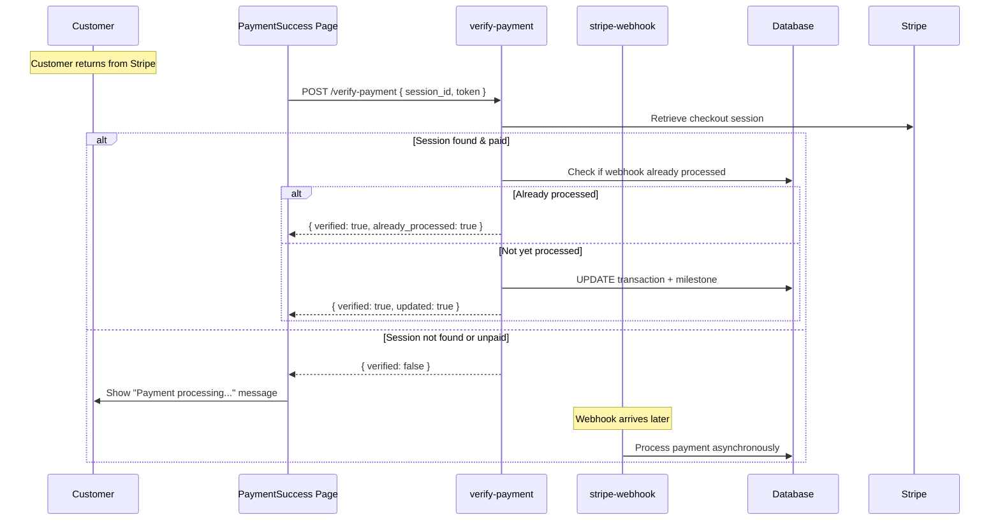

---

## 7. Deployment & Infrastructure

### 7.1 Cron Schedules

| Function | Schedule | Purpose |
|----------|----------|---------|
| `auto-workflow-manager` | Every 15 minutes | Auto-advance quote/invoice statuses based on business rules |
| `unified-reminder-system` | Daily (8:00 AM ET) | Send payment reminders, event reminders, follow-ups |
| `token-renewal-manager` | Daily (2:00 AM ET) | Extend customer portal tokens expiring within 7 days |

### 7.2 Stripe Configuration

| Item | Value |
|------|-------|
| Webhook endpoint | `https://qptprrqjlcvfkhfdnnoa.supabase.co/functions/v1/stripe-webhook` |
| Events subscribed | `checkout.session.completed`, `checkout.session.async_payment_failed` |
| Signature verification | `constructEventAsync()` (Deno async requirement) |
| Success URL pattern | `/payment-success?session_id={CHECKOUT_SESSION_ID}&token={TOKEN}&type={TYPE}` |
| Cancel URL pattern | `/payment-canceled?token={TOKEN}` |

### 7.3 Required Environment Variables

| Secret | Used By | Purpose |
|--------|---------|---------|
| `STRIPE_SECRET_KEY` | Payment edge functions | Stripe API authentication |
| `STRIPE_WEBHOOK_SECRET` | `stripe-webhook` | Webhook signature verification |
| `GMAIL_USER` | `send-smtp-email` | SMTP sender address |
| `GMAIL_APP_PASSWORD` | `send-smtp-email` | Gmail app password for SMTP |
| `SITE_URL` | Email templates, redirect URLs | Base URL for all generated links |

### 7.4 Cross-References

- **Status transitions**: See [STATUS_TRANSITION_MATRIX.md](./STATUS_TRANSITION_MATRIX.md) for complete state machine rules
- **Workflow diagrams**: See [WORKFLOW_DIAGRAMS.md](./WORKFLOW_DIAGRAMS.md) for mermaid flowcharts
- **Admin operations**: See [ADMIN_GUIDE.md](./ADMIN_GUIDE.md) for daily workflow instructions
- **Payment testing**: See [PAYMENT_TESTING_GUIDE.md](./PAYMENT_TESTING_GUIDE.md) for Stripe test flows
- **Component inventory**: See [CODEBASE_MAP.md](../CODEBASE_MAP.md) for full file-level mapping

---

*Last updated: February 2026 — Soul Train's Eatery Catering Platform v3.0*
