# 🎯 Soul Train's Eatery - Workflow Diagrams

Complete visual documentation of all customer and admin workflows with status transitions.

---

## **1. Simple Quote Approval Flow**

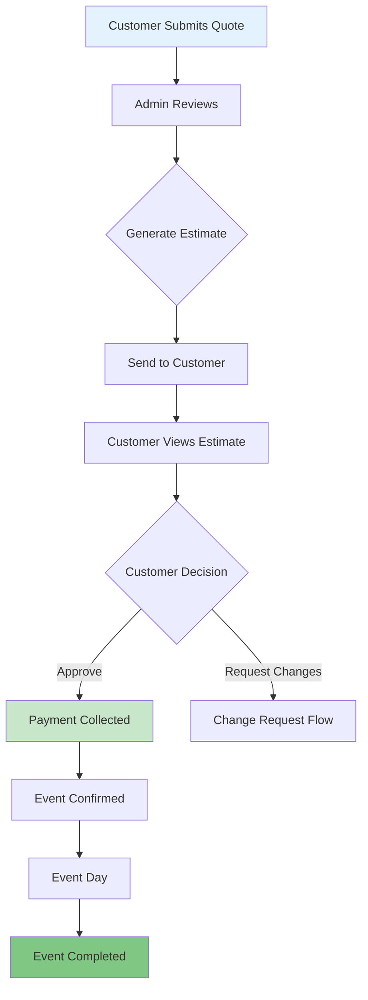

**Status Transitions:**
- Quote: `pending` → `estimated` → `confirmed` → `completed`
- Invoice: `draft` → `sent` → `approved` → `paid`

---

## **2. Change Request Flow**

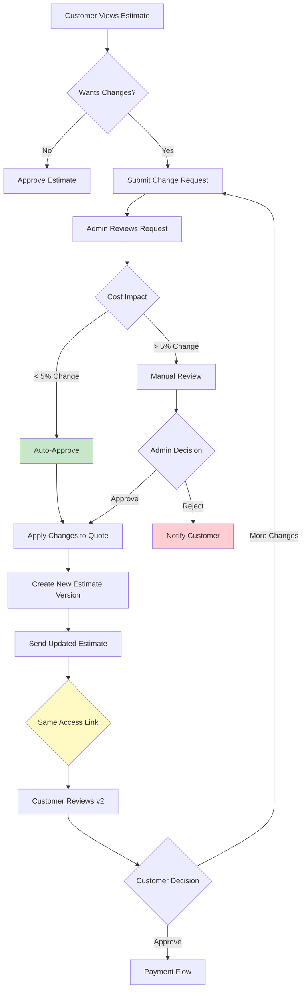

**Key Features:**
- ✅ Same customer access token persists across versions
- ✅ Estimate version history maintained
- ✅ Smart auto-approval for minor changes (<5%)
- ✅ Database trigger recalculates totals automatically

---

## **3. Payment Milestone Flow**

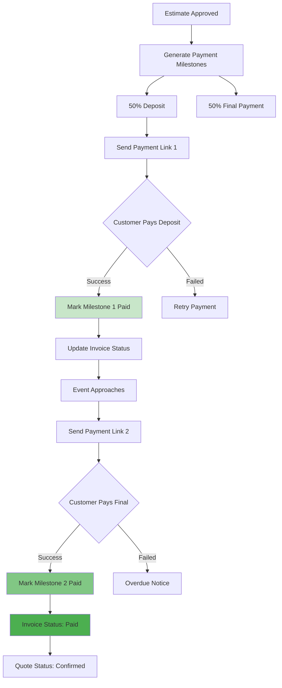

**Payment Statuses:**
- Milestone: `pending` → `paid`
- Invoice: `sent` → `approved` → `paid`
- Quote: `estimated` → `confirmed`

---

## **4. Government Contract Flow**

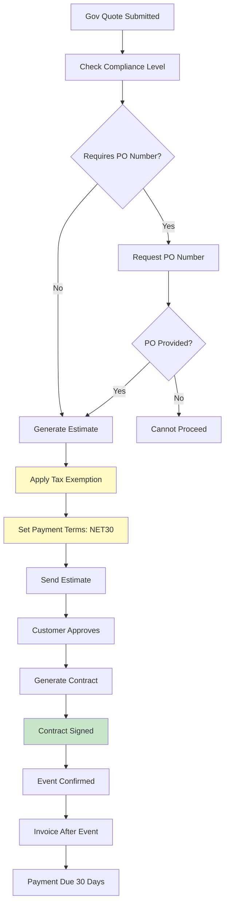

**Government-Specific Rules:**
- ✅ Tax rate = 0% (exempt)
- ✅ PO number required and validated
- ✅ NET30 payment terms
- ✅ Compliance level: `government`

---

## **5. Status Transition State Machine**

### Quote Workflow Status

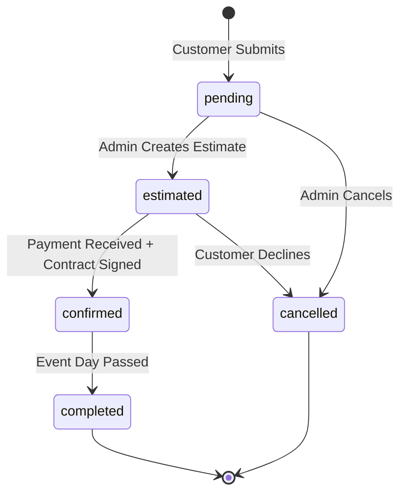

**Valid Transitions:**
- `pending` → `estimated` | `cancelled`
- `estimated` → `confirmed` | `cancelled`
- `confirmed` → `completed`

### Invoice Workflow Status

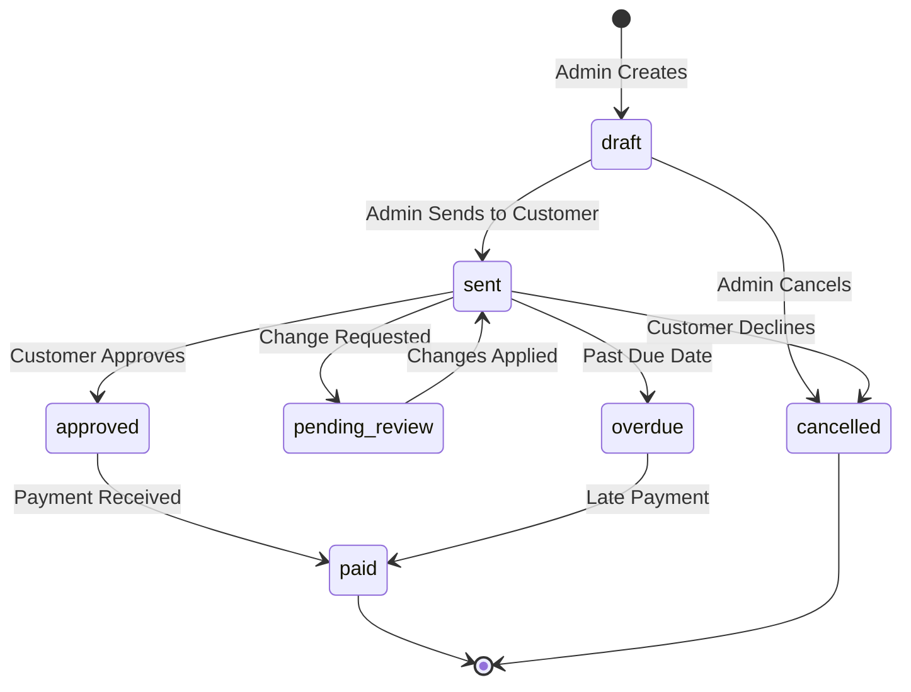

**Valid Transitions:**
- `draft` → `sent` | `cancelled`
- `sent` → `approved` | `pending_review` | `overdue` | `cancelled`
- `pending_review` → `sent`
- `approved` → `paid`
- `overdue` → `paid`

---

## **6. Email Notification Flow**

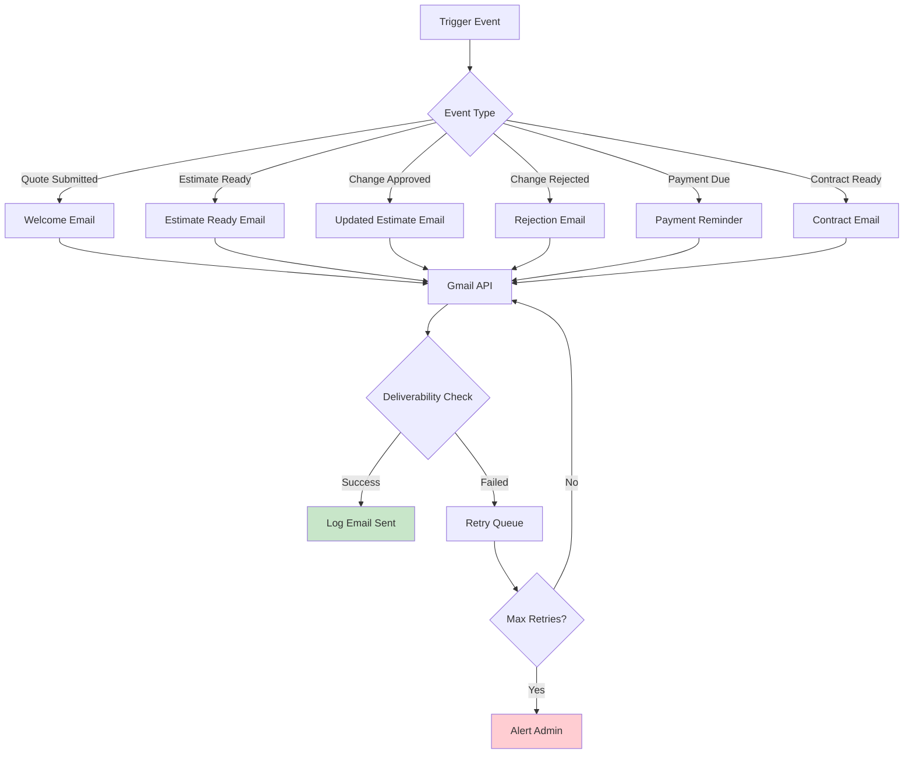

**Email Types:**
1. **Welcome** - Quote submission confirmation
2. **Estimate Ready** - Custom estimate prepared
3. **Change Response** - Approved or rejected changes
4. **Payment Reminder** - Milestone due soon
5. **Contract Ready** - Contract signature required
6. **Event Reminder** - 3 days & 1 day before event

---

## **7. Automated Workflow Manager**

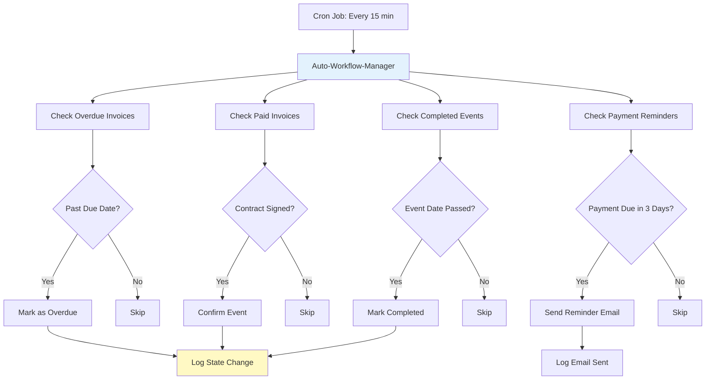

**Automation Schedule:**
- **Every 15 minutes**: Check for status transitions
- **Daily at 2 AM**: Token renewal check
- **Automated Actions**:
  - Mark overdue invoices
  - Confirm paid events
  - Complete past events
  - Send payment reminders

---

## **8. Customer Access Token Lifecycle**

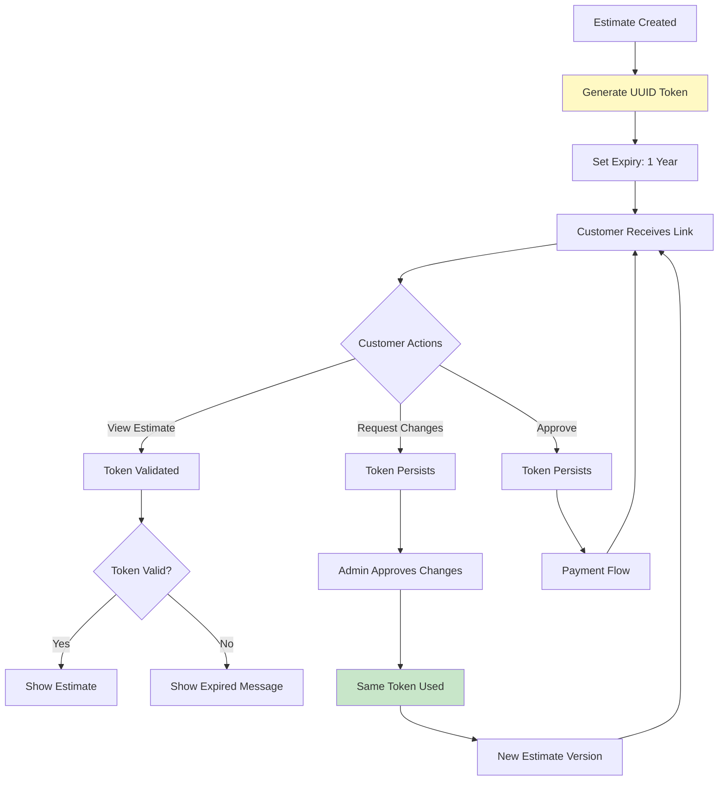

**Token Rules:**
- ✅ Generated once on first estimate
- ✅ Never regenerated (even after changes)
- ✅ 1-year expiry from creation
- ✅ Used in URL: `/estimate?token={uuid}`

---

## **9. Database Trigger Flow**

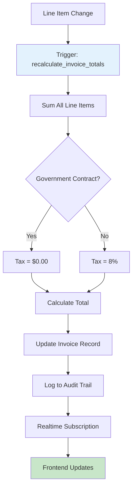

**Trigger Events:**
- Line item added
- Line item quantity changed
- Line item deleted
- Line item price updated

**Calculations:**
- `subtotal` = SUM(line_items.total_price)
- `tax_amount` = `is_gov` ? 0 : subtotal * 0.08
- `total_amount` = subtotal + tax_amount

---

## **10. Multi-Change Cycle Flow**

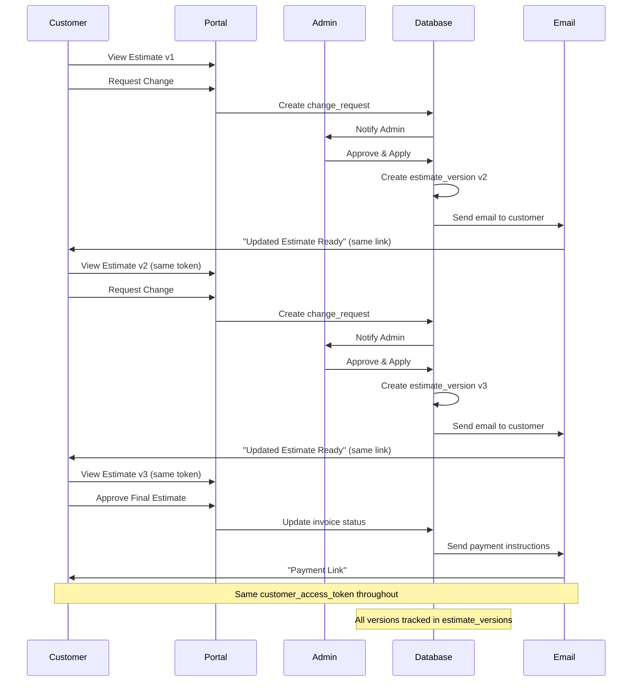

---

## **Status Color Coding**

| Status | Color | Meaning |
|--------|-------|---------|
| `pending` | 🔴 Red | Requires action |
| `estimated` | 🟡 Yellow | Awaiting customer |
| `confirmed` | 🟢 Green | Active/approved |
| `paid` | 🟢 Dark Green | Payment complete |
| `completed` | ✅ Check | Event finished |
| `cancelled` | ⚫ Gray | Inactive |
| `overdue` | 🔴 Red Alert | Urgent action needed |

---

## **Quick Reference: Who Can Do What**

### Customer Actions
- ✅ Submit quote request
- ✅ View estimate (via access token)
- ✅ Request changes
- ✅ Approve estimate
- ✅ Make payments
- ✅ Sign contract
- ❌ Edit pricing
- ❌ Change workflow status manually

### Admin Actions
- ✅ Review quote requests
- ✅ Create/edit estimates
- ✅ Approve/reject change requests
- ✅ Send emails
- ✅ Process payments
- ✅ Generate contracts
- ✅ Override workflow status
- ✅ View audit logs

### System (Automated)
- ✅ Mark overdue invoices
- ✅ Confirm paid events
- ✅ Complete past events
- ✅ Send reminders
- ✅ Recalculate totals
- ✅ Log all state changes
- ❌ Approve change requests (requires admin)
- ❌ Process refunds (requires admin)
